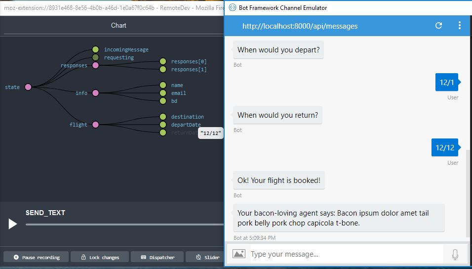

# Botbuilder Redux Middleware

## Motivation
The goal using Redux is to make the behavior of the bot deterministic, given the state and the series of action being dispatched. This lessens the cognitive load when developing the flow as the author of the bot only has to focus on the single state at a given time. Passing only serializable data into pure functions (what redux is all about) also makes testing the bot behavior incredibly easy. 

On top of all this, we get the rich ecosystem of tools for debugging, visualization.  For example, we can use [Remote Redux Devtools](https://github.com/zalmoxisus/remote-redux-devtools) to view all the transitions in our bot!

Here is the similarity I see between Bot design and UI Data Managment

| Bot                                          | Browser                                                  |
|----------------------------------------------|----------------------------------------------------------|
| Stateful Conversation                        | Stateful DOM                                             |
| Dispatch User Messages                       | Dispatch User Events                                     |
| Deterministic Response given State           | Deterministic View Layer given State                     |
| Needs to react to Unpredictable Prompt       | Needs to react to Unpredicable User Interaction on Page  |


-------------

## Terminology
### State
A POJO that describes the entire conversation of the bot interaction with the user. This is the only necessary object. It determines what the bot IS.

### Action
The only way to change the state. Can think of as events or request to change the state. It is an object with a type property on it along with any other information. It describes what the bot wants to do.
‎
### Dispatcher
Dispatches actions such as incoming message or found intent to the reducer. This is the connector between the action and the reducer
‎
### Reducer
Mutate the state which has previous turn data, It describes how the bot will change.

### Renderer
This is the only concept that is outside of the traditional Redux system.  Typically this is done in the view layer.  Technically this does not have to be part of this library, and is only included for convinence.  A renderer is simply a function that takes in the context and the state, and "renders" the responses to the user.

------------

## How to Use

The `BotReduxMiddleware` is meant to be unopininated on _how_ you use your redux store.  All it does is storing the state to storage for the next turn, and recreating the store from the stored state.  (The package doesn't even require redux)  It's up to the user to compose the store, and the middleware does the wiring between `context.storage` and the redux store between turns.

```js
const {BotReduxMiddleware, getStore} = require('botbuilder-redux') //getStore is simply a helper function

const createStoreFunction = (stateFromStorage) => {
  // User specifies the default State if nothing is from the storage (very first turn)
  const defaultState = {requesting: null, responses: []} 
  return createStore(reducer, stateFromStorage || defaultState)
}
...
const bot = new Bot(adapter)
    .use(new MemoryStorage())
    .use(new BotReduxMiddleware((stateFromStorage) => {
      const defaultState = {requesting: null, responses: []}
      return createStore(reducer, stateFromStorage || defaultState)
    }))
    .onReceive((context) => {
      reduxStore = getStore(context)
      const {getState} = reduxStore
      // control your bot with redux state
    })
```

------------
## Examples

Take a look at the `examples` directory to see how you can use the middleware in various scenarios and different ways of implementing a bot using the Redux Middleware

### `examples/simpleBot` (Simple Bot)
The simple bot does not use any complex middleware.  It simply asks you for a name, and greets you after you answer.

### `examples/devToolBot` (Bot with Redux Dev Tool)
The bot spins up a dev server and includes a community-supported redux-devtool middleware.  When you start the bot, and use your remote redux devTools, you can see the state of the bot on any given turn.  Unfortunately, because the store is created on every turn, the dev tool will not have a full history of the conversation (only the current turn).

### `examples/convoBot` (Super Readable Prompt Flow)
Using the power of async/await, and the "single source of truth" nature of the redux state, we can create some interesting abstractions on top of the easy-to-understand primitive!

we can create "prompt" flow like this:

```js

const bookFlightTopic = async (context) => {
  const store = getStore(context)
  const convo = new Conversation('flight', store)
  const dest = convo.ask('Where would you like to go?', 'flight.destination')
  const depart = convo.ask('When would you depart?', 'flight.departDate')
  const ret = convo.ask('When would you return?', 'flight.returnDate')
  if (dest && depart && ret) {
    // Book the flight
    const confirmationText = fetch('https://baconipsum.com/api/?type=all-meat&sentences=1&start-with-lorem=1')
    convo.reply(`Ok! Your flight is booked!`)
  }
}
```


-------------
## Some Convention (from the examples):

By building the examples, there are some conventions that emerged.  Of course these are all not required to use the middleware, but will certainly make your bot development experience easier.

### Some Default Actions
* `{type: "INCOMING_MESSAGE", data: userMessage}` - message from the user
* `{type: "CLEAR_RESPONSES"}` - clear the responses

There is a `IncomingMessageReduxMiddleware` bot middleware that you can include, which will automatically fire the two actions for you. You can then decide how to handle the two actions in your reducer.

### TODO
- [] example of `combineReducer` separated by topics
- [] example of topic 